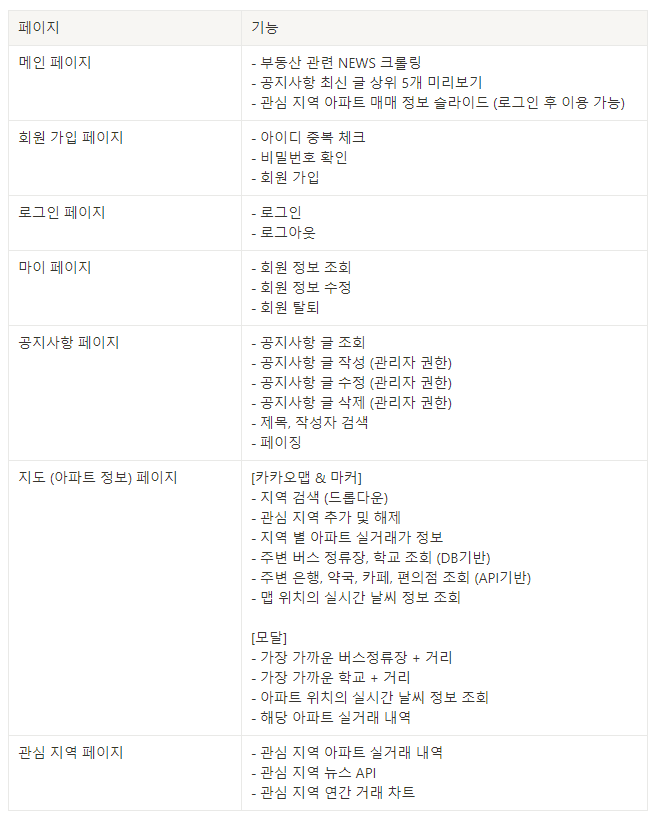

# 집찾(zipchat) 🏙
### [프로젝트] 아파트 실거래가 조회 및 주변 공공시설 정보 제공 웹사이트
### 우수상 수상 🥈

 

## **개요** ✅
- **국토 교통부 아파트 매매 실거래 자료**를 통해 쉽게 시세를 알 수 있게 해주고, **주변 상권 및 시설 위치**를 함께 제공
- **관심 지역**을 설정하여 관심 지역의 정보를 추가 제공
 

## 프로젝트 기간 📆
8일

 

## 기술 스택 🛠

  
  
  
  
  
  
  
  
  
   
  

 

## 팀원 💻
<table>
  <thead>
    <tr>
      <th>이름</th>
      <th>구현 기능</th>
    </tr>
  </thead>
  <tbody>
    <tr>
      <td rowspan="2">이종민</td>
      <td>Back End - 전반</td>
    </tr>
    <tr>
      <td>Front End - Vuex(회원관리, 게시판, 뉴스API, 관심지역, 날씨 API), 차트, 슬라이드</td>
    </tr>
    <tr>
      <td rowspan="2">최희경</td>
      <td>Back End - 아파트 실거래가 매매, 버스정류장, 학교 데이터 DB 설계 및 REST API 구현</td>
    </tr>
    <tr>
      <td>Front End - 전반</td>
    </tr>
  </tbody>
</table>

 

## 기능

 

## 실행 화면

### **🔗메인 페이지**

 ⭕ 3개의 섹션으로 메인 페이지 구성 (1.메인 화면, 2.부동산 관련 뉴스 및 공지사항, 3.관심지역 매물 정보 슬라이드)
  
 ⭕ 관심지역 매물 정보 슬라이드는 로그인 상태에서만 볼 수 있다
 
 
 

---
### **🔗 회원 정보 관련 페이지**

 ⭕ 회원가입 시 아이디 중복여부 체크, 비밀번호 확인을 통해 추가로 체크
 
 
 

 ⭕ 회원정보 확인 및 수정, 탈퇴 
 
 
 

---
### **🔗 공지사항 페이지**

 ⭕ 공지사항 페이징 구현
  
 ⭕ 키워드를 통해 제목, 작성자로 검색 가능
 
 
 

 ⭕ 관리자만 공지사항 작성, 수정, 삭제 가능
 
 
 

---
### **🔗 지도 (아파트 검색 페이지)**

 ⭕ 드롭다운을 선택해 원하는 지역의 아파트 실거래가 조회
  
 ⭕ 드롭다운 뿐만 아니라 드래그로 지도를 움직일 때에도 마커가 갱신된다
  
 
 
 ⭕ '관심지역등록' 버튼을 클릭해 관심지역으로 추가할 수 있다
  
 ⭕ 관심지역으로 등록된 지역은 '관심지역해제' 버튼으로 바뀌며, 이 버튼으로 관심지역을 삭제할 수 있다
 
 
 ⭕ 지도 좌표의 일정 거리 내에 있는 버스정류장, 학교, 카페, 약국, 은행, 편의점을 지도에 마커로 띄운다
  
 ⭕ 버스정류장, 학교는 DB기반의 데이터이다
  
 ⭕ 학교, 카페, 약국, 은행, 편의점은 카카오 API가 제공하는 데이터를 사용하였다

 
 ⭕ 아파트 마커를 클릭하면 우측에 모달 창이 나타난다
  
 ⭕ 선택한 아파트에서 가장 가까운 버스정류장 3곳과 학교 3곳을 알려주고, 직선 거리도 계산하여 보여주도록 하였다 (하버사인 공식 이용)
  
 ⭕ 선택한 아파트의 위치 정보에 대한 실시간 날씨를 보여준다
  
 ⭕ 선택한 아파트의 매매 정보를 리스트로 보여준다
  
 ⭕ UX를 고려하여, 지도의 빈 공간을 클릭하면 모달 창이 사라지고, 맵을 드래그 하는 경우에는 사라지지 않도록 하였다
  
  
 
 ⭕ 지도를 움직일 때마다 중심 좌표에 대한 실시간 날씨를 갱신하여 보여준다
 
 
 

---
### **🔗 관심지역 페이지**

 ⭕ 관심지역으로 추가된 지역의 매매 정보 리스트  
 &nbsp; &nbsp; &nbsp; 관심지역의 뉴스 및 연도별 거래 횟수 차트
 
 

 ⭕ 메인 페이지에서 관심지역으로 추가된 지역의 최신 거래내역 3개를 보여준다
 
